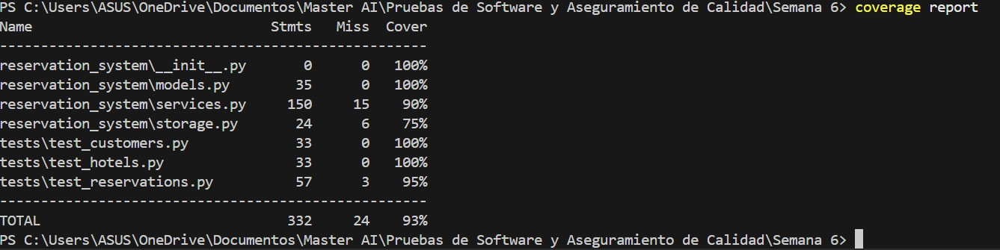

# Reservation System – Evidencias de Pruebas

## Descripción
Este proyecto implementa un sistema de reservaciones en Python utilizando pruebas unitarias con el módulo unittest.

## Cómo ejecutar el proyecto

1. Clonar el repositorio:
git clone https://github.com/samacias/A01620186_A6.2.git

2. Entrar a la carpeta del proyecto:
cd reservation_system

3. Ejecutar las pruebas:
python -m unittest discover tests

## Evidencias de calidad de código

Se ejecutaron las herramientas:

- flake8  
- pylint  

Resultados:

- No se detectaron errores críticos en el código.  
- El código cumple con buenas prácticas de estilo según PEP-8.

## Evidencias de ejecución de pruebas

Las pruebas unitarias incluyen:

- Creación de reservaciones  
- Validación de habitaciones ocupadas  
- Validación de hotel inexistente  
- Cancelación de reservaciones  

Cobertura obtenida del sistema:

